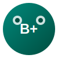

# BioPlus - 生命科学实践应用平台

## 早上好

## 欢迎来到 BioPlus

BioPlus 是一个专注于**生命科学实践应用**的科普平台。我们致力于连接科研问题、研究组与研究成果，让生命科学知识触手可及。

## 我们的使命

- **普及生命科学知识**：让更多人了解生命科学在现实世界中的应用
- **连接科研与大众**：搭建科研人员与公众之间的桥梁
- **推动成果转化**：展示生命科学领域的最新研究成果和应用

## 核心内容

### 🧬 基因编辑应用
探索 CRISPR 基因编辑技术在临床治疗、遗传病治疗等领域的最新进展。

### 🏥 医学诊断
了解液体活检、人工智能辅助诊断等前沿医学技术。

### 💊 药物研发
关注抗体药物、AI 制药等创新药物研发领域。

### 🔬 生物技术
探索合成生物学、细胞治疗等颠覆性生物技术。

## 特色内容

| 板块 | 说明 |
|------|------|
| **研究组** | 介绍国内外顶尖生命科学研究团队 |
| **成果转化** | 展示从实验室到临床的转化成果 |
| **科普文章** | 深入浅出的生命科学科普内容 |

## 加入我们

关注我们，获取最新生命科学资讯！

- 📧 联系我们：contact@bioplus.com
- 📱 微信公众号：BioPlus
- 🐙 GitHub：BioPlus
